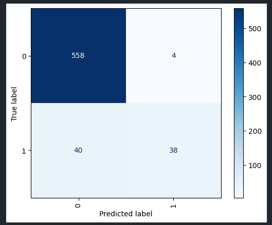
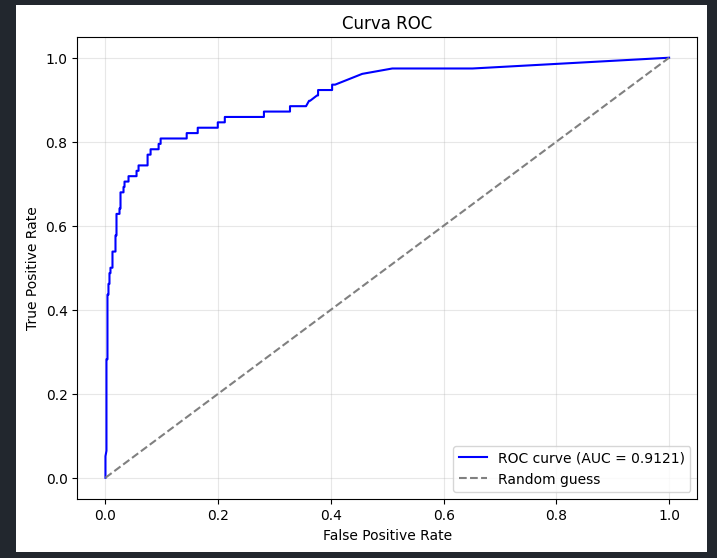

# 🕵️‍♂️ Risk Analyst Case – Detecção de Comportamentos Suspeitos e Solução Antifraude

## 📌 Objetivo
Este projeto tem como objetivo analisar uma base de **transações hipotéticas** em ambiente **card-not-present (CNP)**, identificar **comportamentos suspeitos** e propor **soluções antifraude**.

---

## 📁 Estrutura do Projeto
├── data
  ├── raw
      ├── transactional-sample.csv # Base de dados fornecida
  ├── processed
      ├── test_processed.csv # Base de teste processada
      ├── train_processed.csv # Base de treino processada
├── notebooks
  ├── eda_feature_engineering.ipynb # Notebook de exploração de feature engineering
  ├── train_model.ipynb # Notebook para treinamento e avaliação de modelos ML
├── README.md # Este documento

---

## 🧠 Descrição do Desafio
O desafio consiste em:
1. Analisar o dataset para identificar **padrões de fraude**.
2. Apresentar **insights e hipóteses** sobre comportamentos suspeitos.
3. Sugerir **dados adicionais** úteis para fortalecer a detecção de fraude.
4. Propor **medidas preventivas** e um **sistema antifraude conceitual**.
5. Explicar **fluxos e papéis** na indústria de pagamentos.

---

## 📊 1. Análise Exploratória (EDA)

### 📌 Variáveis principais
- `transaction_id`: identificador da transação
- `card_number`: número do cartão
- `transaction_date`: timestamp da transação  
- `user_id`: identificador do portador do cartão  
- `device_id`: identificador do dispositivo  
- `merchant_id`: identificador do comerciante  
- `transaction_amount`: valor da transação  
- `has_cbk`: indica se houve chargeback (1 = fraude)  

### 🔍 Perguntas investigadas
- Fraudes ocorrem com **valores médios mais altos**?
  R: Sim, pode-se constatar que a média dos valores das transações fraudulentas é mais que o dobro do que transações normais

- Existem **merchants**, **users** ou **devices** com alta concentração de fraudes?
  R: Sim, existe um público pequeno de cada um desses ids que concentra mais que 70% das fraudes

- Há **padrões temporais** (dia da semana, período do dia)?  
  R: Nota-se um padrão de fraudes concentradas a noite e nas sextas-feiras.

- Comportamento da transação é **coerente com o histórico do usuário**?
  R: Existe claramente um desvio do comportamento padrão do usuário para transações fraudulentas.

- O **volume de transações** está correlacionado com o percentual de fraudes?
  R: Aparentemente não existe relação entre o volume de transações e o percentual de fraudes, mas ficaria mais assertivo definir analisando um dataset maior.

---

### ⚙️ Engenharia de Features

#### 🧮 Variáveis criadas
| Feature | Descrição |
|----------|------------|
| `transaction_hour` | Hora da transação |
| `transaction_day` | Dia da semana da transação |
| `transaction_period` | Manhã, Tarde, Noite, Madrugada |
| `mean_amount_user` | Média do usuário |
| `median_amount_user` | Mediana do usuário |
| `ratio_to_user_mean` | Relação entre transação e média do usuário |
| `diff_from_user_mean` | Diferença da média do usuário X valor da transação|
| `mean_amount_day` | Média global por dia da semana |
| `median_amount_day` | Mediana global por dia da semana |
| `diff_from_mean_day` | Diferença da média do dia X valor da transação|
| `ratio_to_mean_day` | Relação com média do dia |
| `mean_amount_period` | Média global por período |

Essas variáveis ajudam a capturar **desvios de comportamento**, fundamentais na detecção de fraudes.

---

## 💰 2. Enriquecimento de Dados

Visando melhorar a detecção de fraudes sugiro o enriquecimento da base de dados com as seguintes variáveis:

- IP address (geolocalização, múltiplos IPs por usuário)
- BIN do cartão (bandeira, país)
- Histórico do usuário (idade da conta, frequência de uso)

---

## 🤖 3. Modelagem

Utilizei métodos de **Machine Learning** para capturar padrões de operações fraudulentas dentro dos dados disponíveis.
Foram testados três algoritmos de ML sendo eles:

- Isolation Forest
- XGBoost
- Random Forest

Usei apenas modelos de árvores já que são os mais utilizados dentro do mercado financeiro e têm melhor desempenho com dados com alta colinearidade.

O algortimo que obteve o melhor desempenho foi o **XGBoost** com as seguintes métricas (base de teste):

### Métricas basicas:

| Métrica | Valor |
-------------------
| `Accuracy` | 0.9313 |
| `Precision` | 0.9048 |
| `Recall` | 0.4872 |
| `F1-score` | 0.6333 |
| `AUC` | 0.9121 |
| `KS` | 0.8781 |

### Matriz de Confusão

### ROC Curve

---

## 🧱 4. Recomendações Antifraude

### 🧭 Curto Prazo (Regras)
- Bloquear transações com `transaction_amount` muito acima da média do usuário.
- Revisar merchants com **alta taxa de chargebacks** (blacklist).
- Bloquear ou revisar **devices** reincidentes (blacklist).

### 🤖 Médio Prazo (Modelagem)
- Treinar **modelo supervisionado** (Isolation Forest / XGBoost) com as features criadas.
- Utilizar **sistema de score de risco** com thresholds.

### 🧠 Longo Prazo (Arquitetura)
- **Pipeline real-time** com:
  1. Ingestão da transação
  2. Enriquecimento (IP, geolocalização, histórico, blacklists)
  3. Cálculo de score
  4. Decisão automática (aprovar / revisar / bloquear)
- **Feedback loop** com chargebacks para re-treinar modelos.

---

## 🏦 5. Contexto da Indústria de Pagamentos

### 💰 Fluxo Financeiro
1. **Cliente** realiza a compra  
2. **Gateway** envia dados para **(sub-)acquirer**  
3. **Acquirer** envia para **bandeira (Visa, Master)**  
4. **Bandeira** consulta o **emissor** (banco do cliente)  
5. Resposta: **autorização ou negação**  
6. Liquidação → valor ao **merchant**

### 📡 Fluxo de Informação
- Transações trafegam por múltiplos players
- Logs e metadados alimentam sistemas antifraude

### 🧱 Diferenças entre Players
| Player | Função | Risco |
|--------|--------|-------|
| **Acquirer** | Processa e liquida transações | Assume risco |
| **Sub-acquirer** | Intermedia merchants | Risco parcial |
| **Gateway** | Só roteia requisições | Não assume risco |

### ⚠️ Chargebacks
- **Chargeback**: devolução forçada do valor ao cliente (disputa ou fraude)
- **Cancelamento**: reversão voluntária
- Alta taxa de chargebacks → indicador de **fraude** ou **ineficiência operacional**

### 🧠 Antifraude
- Sistema que analisa transações em tempo real
- Calcula score com base em regras e modelos
- Acionamento de revisão manual, bloqueio ou aprovação

---

## 📚 Tecnologias Utilizadas
- **Python 3.11**
- **Pandas / NumPy** (análise de dados)
- **Matplotlib / Seaborn** (visualização)
- **Scikit-learn** (ML, pré-processamento)

---

## 🧾 Conclusão
A análise demonstrou que **padrões estatísticos simples**, combinados com **modelos de machine learning** e **regras de negócio**, são capazes de identificar **comportamentos potencialmente fraudulentos**.  
O próximo passo é a **integração desses insights** em um **pipeline antifraude operacional**, com **modelos supervisionados** e **revisão contínua baseada em chargebacks**.

---

## 👤 Autor
**João Victor Cardoso**  
📧 [joaovictorcs.20@gmail.com]  
💼 [[LinkedIn](https://www.linkedin.com/in/jo%C3%A3o-victor-cardoso/) / [GitHub](https://github.com/joaovcardosodev) ]